# 🧩 Microservices Notes

A comprehensive reference guide for Microservices architecture, patterns, and best practices.

---

## 📋 Table of Contents

- [Introduction](#-introduction)
- [Monolith Architecture](#-monolith-architecture)
- [Microservices Architecture](#-microservices-architecture)
- [Database per Service](#-database-per-service)
- [Shared Database](#-shared-database)
- [NoSQL](#-nosql)
- [Remote Procedure Invocation](#-remote-procedure-invocation)
- [Messaging](#-messaging)
- [Types of Microservices](#-types-of-microservices)
- [Service Orchestration](#-service-orchestration)
- [Service Choreography](#-service-choreography)
- [API Gateway](#-api-gateway)
- [Authentication & Authorization](#-authentication--authorization)
- [Backend for Frontend](#-backend-for-frontend)
- [CQRS](#-cqrs-command-query-responsibility-segregation)
- [Server Side Discovery](#-server-side-discovery)
- [Client Side Discovery](#-client-side-discovery)
- [Service Registry](#-service-registry)
- [Centralized Configuration](#-centralized-configuration)
- [Quick Reference Table](#-quick-reference-table)

---

## 🎯 Introduction

**Who Is This For?**

- **Web Programmer** — Understands how frontend integrates with multiple backend services
- **Backend Programmer** — Learns how to design and maintain independently deployable services
- **Software Architect** — Gains the tools to design scalable, distributed system architectures
- **DevOps Engineer** — Understands the deployment, scaling, and operational needs of microservices

**What This Material Covers**

- Theory and concepts behind microservices
- Real-world case studies
- Not tied to any specific technology stack

**Why Learn Microservices?**

- Industry-standard knowledge in modern tech companies
- Rich supporting ecosystem
- Widely adopted by leading tech companies, especially at scale
- Required knowledge for Senior Engineers

---

## 🏛️ Monolith Architecture

> **Analogy:** Think of a traditional restaurant where one big kitchen handles everything — cooking, frying, making drinks — all in the same place. If the stove breaks, the entire restaurant shuts down. Everyone depends on the same kitchen, the same equipment, the same staff.

**What is Monolith Architecture?**

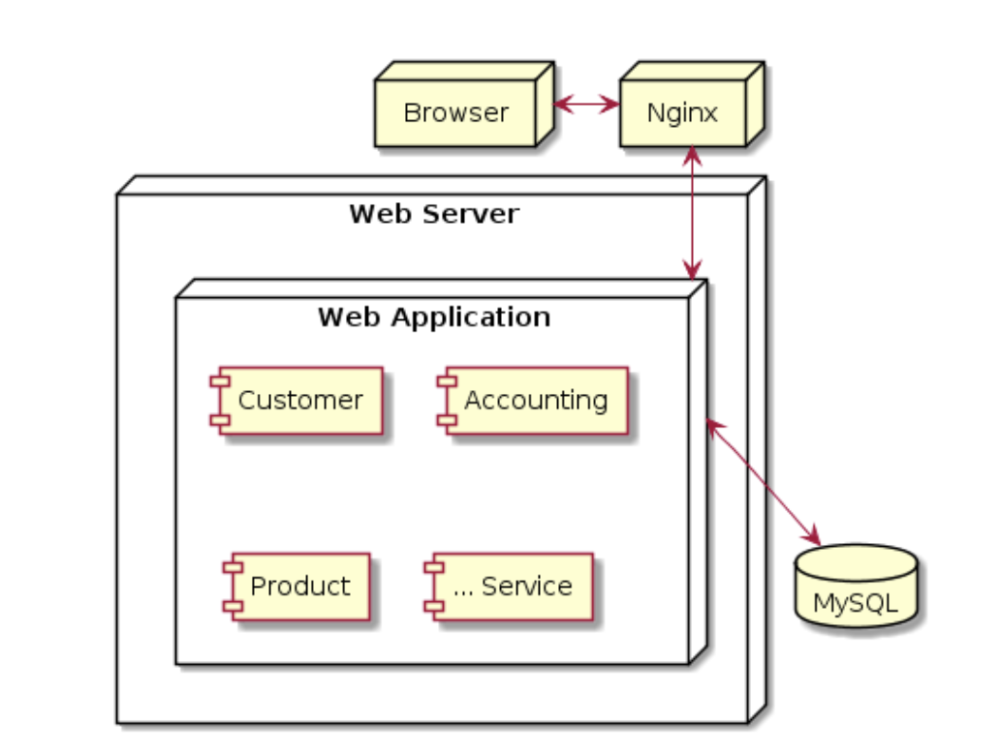

A monolith is an application where all features — user management, product catalog, payments, notifications — are built and bundled together into a single deployable unit.

> 💡 **Start with monolith.** For a new project, a monolith is often the right starting point. It's simple, fast to build, and easy to understand.

**Advantages of Monolith Architecture**

- **Easy to develop** — Everything is in one place; no inter-service communication to manage
- **Easy to deploy** — A single artifact to build and ship
- **Easy to test** — End-to-end tests run in one process
- **Easy to scale** — Deploy more copies of the entire application

**Problems with Monolith Architecture**

- **Intimidating for new developers** — The entire codebase must be understood before contributing
- **Scaling development with many engineers is difficult** — Merge conflicts, slow CI, team coordination overhead
- **Long-term technology lock-in** — Tightly coupled to a single language, database, and framework
- **Cannot scale specific parts** — The entire application must be scaled even if only one feature is under load
- **Heavy to run locally** — The full app must start even for small changes

---

## ⚙️ Microservices Architecture

> **Analogy:** A modern food court instead of one big kitchen. Each stall (service) specializes in one thing — one for drinks, one for main courses, one for desserts. If the drinks stall has a problem, the food stalls keep running. Each stall can expand or replace its equipment independently.

**What is Microservices Architecture?**

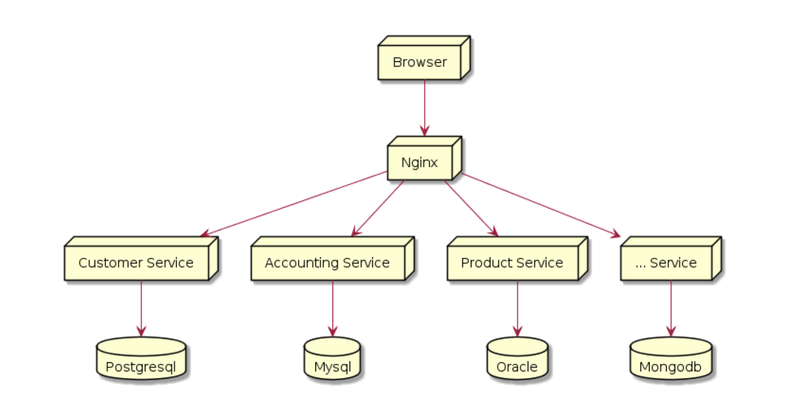

- Small, focused applications that work together
- Each service does **one thing well**
- **Independent** — can be deployed and changed without depending on other services
- Each component in the system is a separate service
- Services communicate with each other via **network calls**

**How Microservices are Divided**

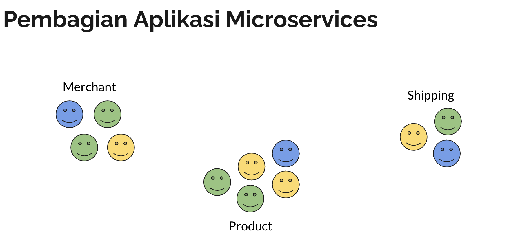

**Advantages of Microservices Architecture**

- **Easy to understand** — Each service is small and focused
- **Easier to develop, maintain, test, and deploy** — Independent lifecycles per service
- **Technology flexibility** — Each service can use the best tool for its job
- **Independent scaling** — Scale only the services that need more resources
- **Small team ownership** — Each service can be owned and operated by a small team

**Problems with Microservices Architecture**

- **Distributed system complexity** — Network failures, latency, and partial failures become real concerns
- **Inter-service communication is error-prone** — Network is not reliable
- **Integration testing is harder** — Testing the interactions between services requires more setup

**How Small Should a Microservice Be?**

- **Single Responsibility** — Each service does one thing well
- **Small enough to be understood by one person**
- **Can be built by a small team** — commonly referenced as the "two-pizza team" rule

**Monolith vs Microservices**

| Monolith | Microservices |
|----------|---------------|
| Simplicity | Partial Deployment |
| Consistency | High Availability |
| Easy to Refactor | Multiple Platform Support |
| — | Easy to Scale |

---

## 🗄️ Database per Service

> **Analogy:** Each restaurant stall owns its own kitchen storage. The drinks stall stores its own syrup and ice; the food stall stores its own ingredients. No stall can walk into another's storage without permission. This keeps things clean, independent, and prevents one messy stall from affecting the others.

**Decentralized Database**

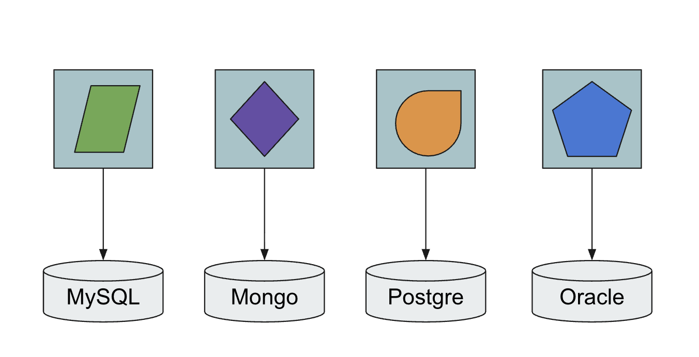

**Why Database per Service?**

- **Ensures independence** — Services are not coupled through a shared database schema
- **Technology freedom** — Each service can use the database type best suited to its needs (SQL, document, key-value, etc.)
- **Encapsulation** — A service never needs to know the internal data structure of another service

**Example: Database per Service**

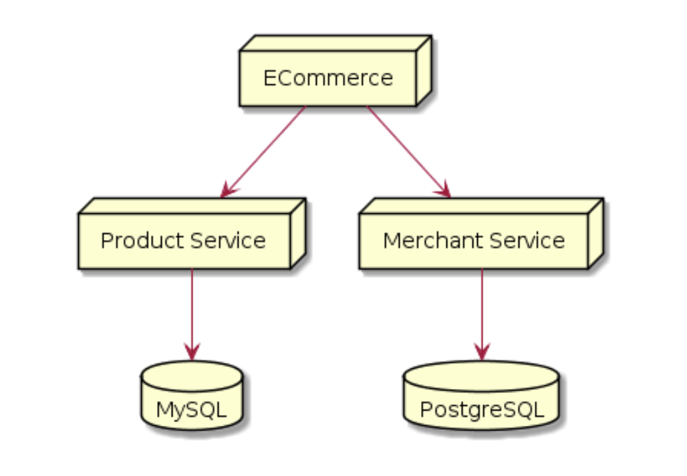

---

## 🔗 Shared Database

> **Analogy:** During a transition period, multiple stalls temporarily share one central storage room. It's not ideal — stalls can accidentally see or touch each other's ingredients — but it's a pragmatic shortcut while the proper separation is being set up.

**Shared Database**

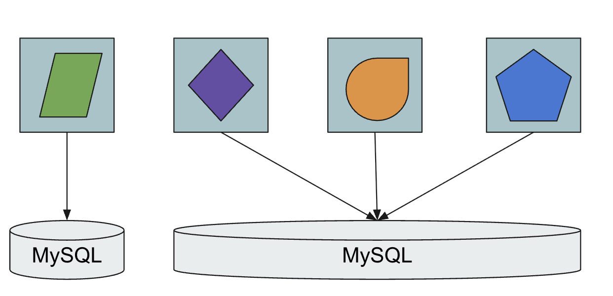

**When to Use Shared Database?**

- When **transitioning** from a monolith to microservices — splitting everything at once is risky
- When you're **unsure how to partition** the data between services
- When there's a **tight deadline** and no time to build proper APIs between services

**Example: Shared Database**

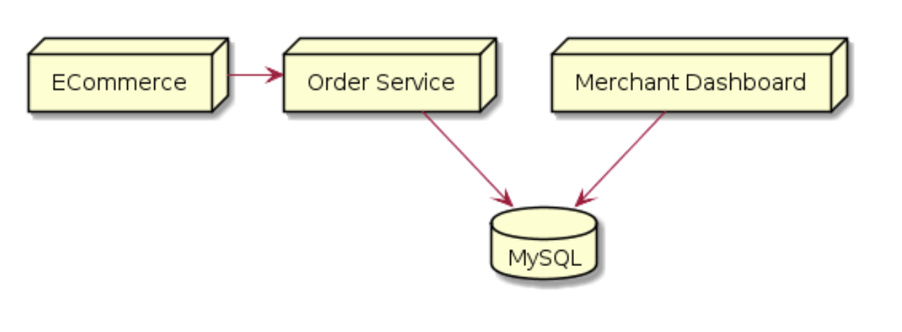

---

## 📊 NoSQL

> **Analogy:** Not all storage needs the same kind of shelf. A library uses bookshelves sorted by category. A warehouse uses racks sorted by size and weight. A photo studio uses flat filing cabinets. NoSQL is a family of different storage solutions, each designed for a different kind of data problem.

**What is NoSQL?**

- NoSQL does **not** mean "NO SQL"
- NoSQL stands for **Not Only SQL** — it extends beyond the relational model

**Types of NoSQL Databases**

| Type | Description |
|------|-------------|
| **Document Oriented** | Stores data as flexible JSON-like documents |
| **Key-Value** | Simple key → value lookups; extremely fast |
| **Column Families** | Stores data in columns rather than rows; great for analytics |
| **Graph** | Stores nodes and relationships; great for social networks |
| **Search** | Optimized for full-text search and filtering |
| **Time Series** | Optimized for time-stamped data (metrics, logs, events) |

**Examples of NoSQL Databases**

- **MongoDB** — Document Oriented Database
- **Elasticsearch** — Search Database
- **Redis** — Key-Value Database
- **Apache Cassandra** — Column Families Database
- **Neo4J** — Graph Database
- **InfluxDB** — Time Series Database

**Why Learn NoSQL?**

- **Match the right tool to the problem** — Not every problem fits a relational table
- **Find alternative data processing strategies** — Document, graph, and time-series models solve different problems
- **Improve performance** — Using the right database type speeds up both writes and reads

**Case Study**

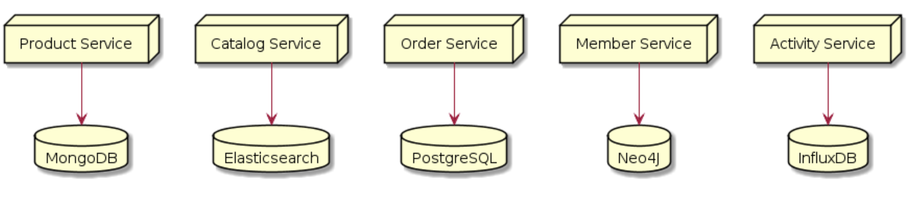

---

## 🔄 Remote Procedure Invocation

> **Analogy:** When one stall needs an ingredient from another, they pick up the phone and call directly. "Do you have any syrup?" — "Yes, I'll send it over." It's synchronous: you wait on the line until you get the answer. It's simple, direct, and straightforward for most requests.

**When a Service Needs Data from Another Service**

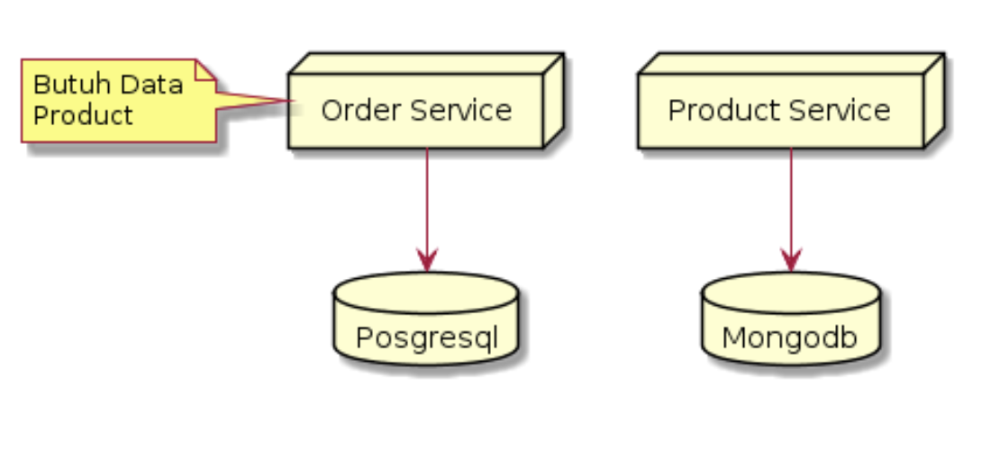

**Inter-Service Communication**

- Ideally done via **RPI (Remote Procedure Invocation)** or **RPC (Remote Procedure Call)**
- **Not recommended** to communicate via a shared database

**Examples of RPI Technologies**

- RESTful API (HTTP)
- gRPC
- Apache Thrift
- SOAP
- Java RMI
- CORBA (Common Object Request Broker Architecture)

**After Calling Another Service**

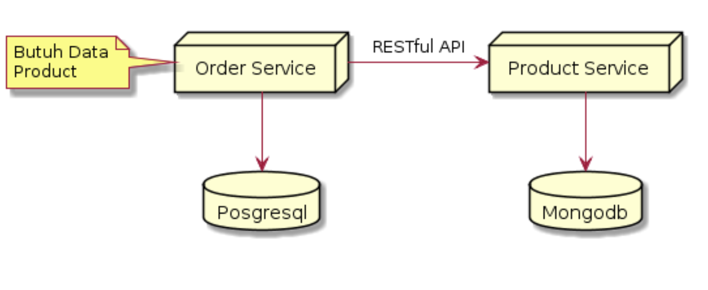

**Advantages of Using RPI**

- **Simple and straightforward** — Easy to implement and reason about
- **Request-Reply pattern** — Natural fit for synchronous workflows
- **Synchronous** — The caller waits for a response, making flow easy to trace

---

## 📨 Messaging

> **Analogy:** Instead of calling each stall one by one, the head kitchen posts an announcement on a bulletin board (message broker): "Order #42 has been placed." Every stall that cares about orders checks the board and handles its own part — the grill station starts cooking, the drinks station starts preparing, the packaging station gets ready — all in parallel, without waiting for each other.

**When a Service Needs Data from Another Service (Async)**

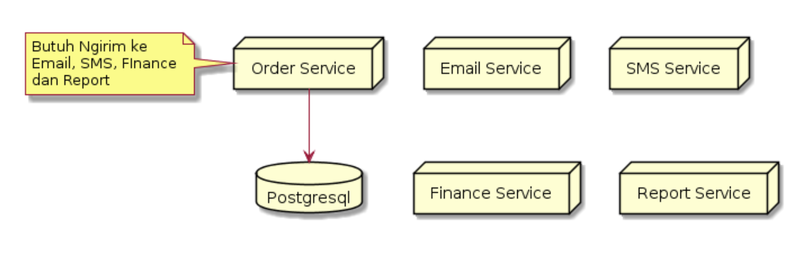

**Problems with RPI Communication**

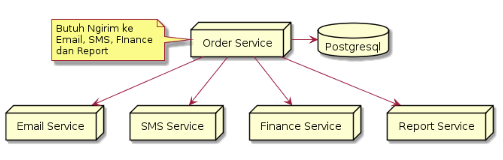

- **Slow for long-running tasks** — Email and SMS services may take time; the caller is blocked waiting
- **Sending the same data multiple times** — Finance and Report services both need the same event
- **Parallel processing is complex** — Coordinating multiple downstream services from one caller is hard

**Communication via Messaging**

- Used for **asynchronous** communication — fire and forget
- The sender does **not need to wait** for a response from the receiver
- Sometimes the sender doesn't care about a reply at all
- Requires a **Message Channel** as the bridge between sender and receiver
- Recommended to use a **Message Broker** application to manage channels

**Examples of Message Brokers**

- Redis (PubSub)
- Apache Kafka
- RabbitMQ
- NSQ
- Google Pub/Sub
- Amazon SQS

**Advantages of Using Messaging**

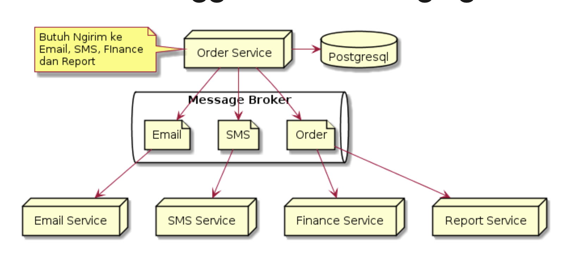

- **Faster** — The sender doesn't wait for the receiver to finish processing
- **Decoupled** — The sender doesn't need to know or care about who receives the message

---

## 🧩 Types of Microservices

> **Analogy:** In a food court, not all stalls play the same role. Some just prepare ingredients (stateless utility). Some own and manage the pantry (persistence). Some act as the head coordinator, combining work from multiple stalls before delivering to the customer (aggregation).

**Three Types of Microservices**

| Type | Description |
|------|-------------|
| **Stateless** | No database; does one simple, self-contained task |
| **Persistence** | Has its own database; manages CRUD operations for a domain |
| **Aggregation** | Depends on other services; orchestrates business logic |

**Stateless Microservices**

- Usually has **no database**
- Used for **simple, self-contained tasks**
- Acts as a **utility** for other microservices
- **Does not depend** on other microservices

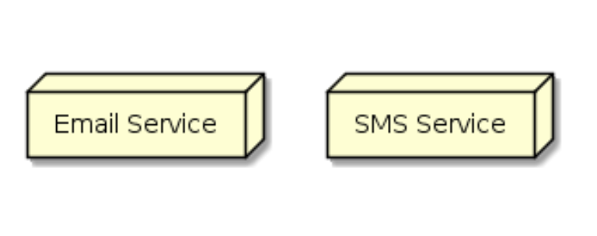

**Persistence Microservices**

- Usually has **its own database**
- Also known as a **Master Data Microservice**
- Handles **CRUD operations** for its domain

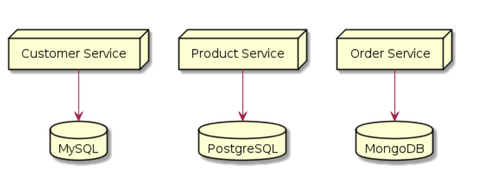

**Aggregation Microservices**

- **Depends on** other microservices
- Acts as the **center of business logic** for a feature or flow
- **May or may not** have its own database
- **Cannot stand alone** — requires other services to function

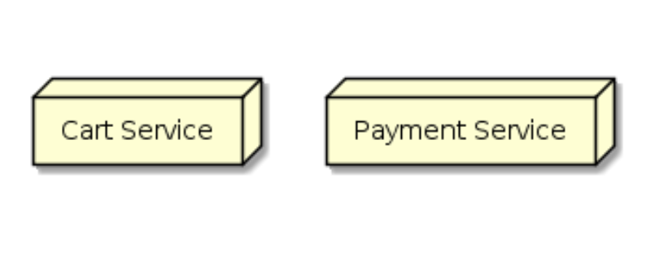

**Case Study**

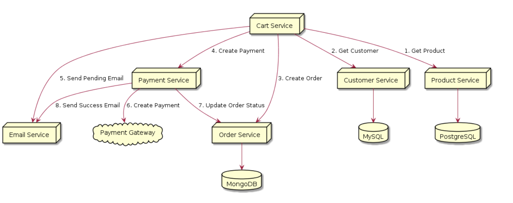

---

## 🎼 Service Orchestration

> **Analogy:** A conductor stands in front of the orchestra and tells every musician exactly when to play. The conductor knows the entire score and gives explicit instructions: "Strings first, then brass, then drums." Without the conductor, the musicians don't know when to start. The conductor is the single point of knowledge and control.

**What is Service Orchestration?**

- When an **Aggregation Microservice** communicates with other services via **RPI (Remote Procedure Invocation)**, that pattern is called **Service Orchestration**
- The Aggregation Microservice is responsible for **orchestrating the entire business logic flow**
- It calls other services directly and waits for their responses

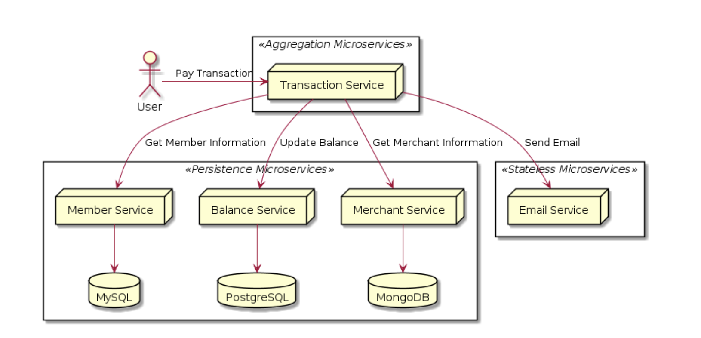

**Advantages of Service Orchestration**

- **Easy to build** — Business logic is centralized in one place
- **Easy to understand** — The entire flow can be traced by reading one service

**Disadvantages of Service Orchestration**

- **Tight coupling** — The Aggregation service depends heavily on all downstream services
- **Slower** — Must wait for each downstream service to respond
- **More fragile** — If any downstream service has a problem, the Aggregation service fails too
- **Requires changes for new services** — Adding a new downstream step means modifying the Aggregation service

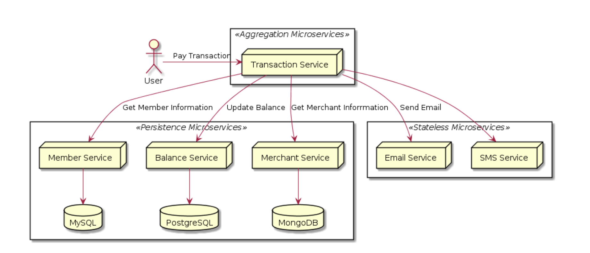

---

## 💃 Service Choreography

> **Analogy:** Instead of a conductor, imagine a dance performance where every dancer has memorized their own routine and listens for music cues. When the beat drops, each dancer knows exactly what to do — no one is being directed in real-time. The performance emerges from all dancers independently responding to the same shared rhythm (the message broker).

**What is Service Choreography?**

- Different from Orchestration — uses **Messaging** instead of direct RPI calls
- In Orchestration, the Aggregation service knows and controls everything
- In Choreography, **every service is smart** — each listens for events and reacts independently
- No single service holds all the knowledge of the full flow

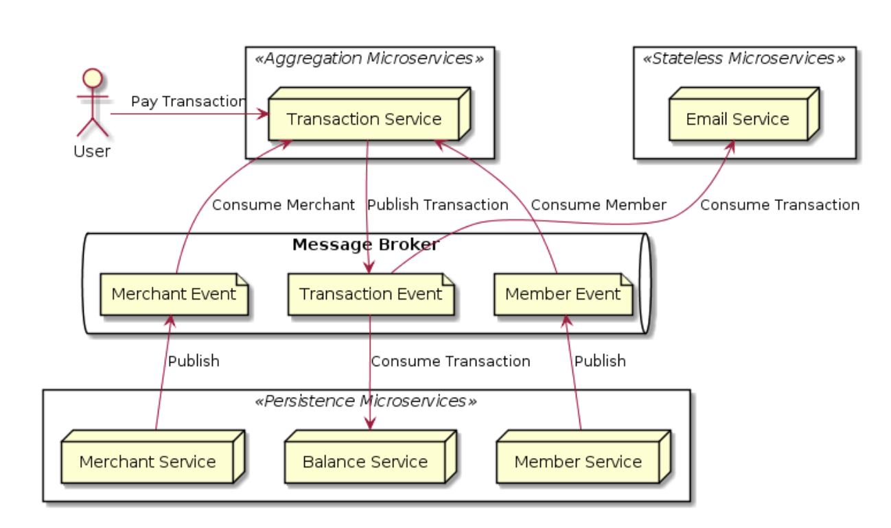

**Advantages of Service Choreography**

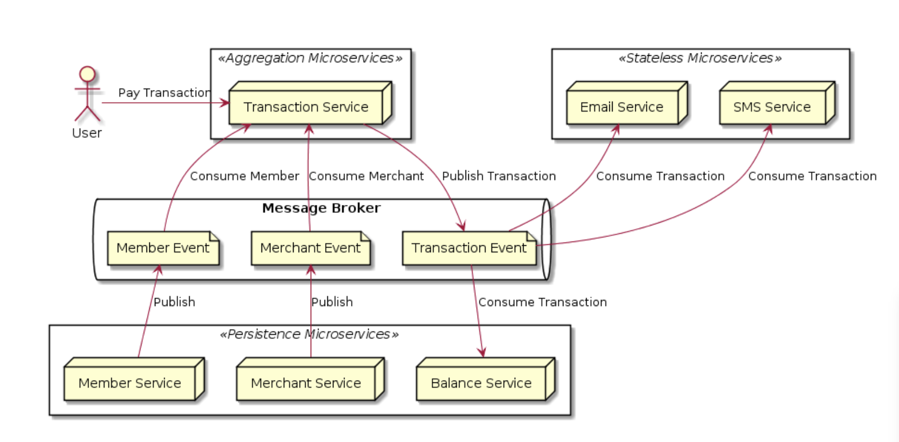

- **Aggregation service is decoupled** — It only publishes events; it doesn't know who consumes them
- **Faster** — No waiting for downstream services to respond synchronously
- **Adding new services is easy** — New consumers just subscribe to existing events; the publisher doesn't change

**Disadvantages of Service Choreography**

- **Harder to debug** — When something goes wrong, tracing the full flow requires checking multiple services and the message broker
- **Business logic is distributed** — The overall flow is spread across many services, making it hard to understand at a glance

---

## 🚪 API Gateway

> **Analogy:** A shopping mall has one main entrance. You don't enter each store through its own back door on a dark alley. At the front entrance, there are security guards, a directory, and a visitor log. All visitors go through one controlled door — and everything behind it stays protected.

**Exposing Microservices Without an API Gateway**

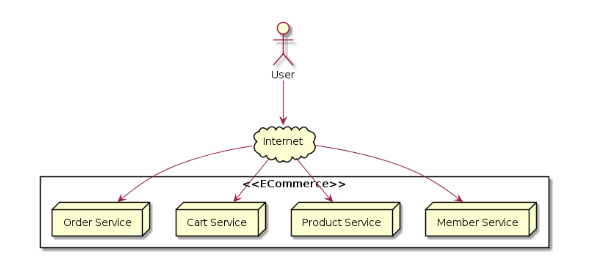

**Problems with Directly Exposing Microservices**

- **All services are accessible from the internet** — Every service is a potential attack surface
- **Authentication must be implemented in every service** — Duplicated effort and inconsistent enforcement
- **Data leakage risk** — Internal service errors and structure are exposed directly to clients

**API Gateway**

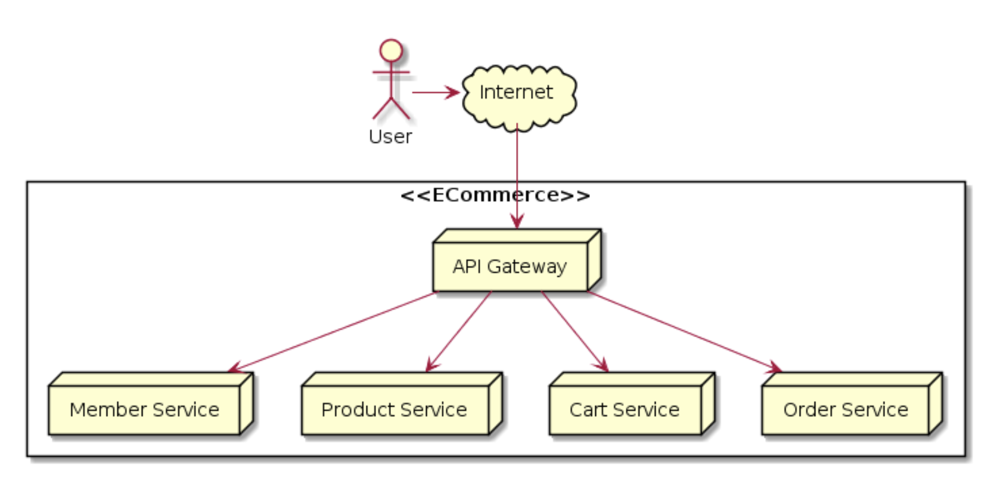

- The API Gateway is the **single entry point** from the outside world into the microservices system
- "Outside" = internet traffic; "Inside" = your microservices
- Acts as a **proxy server** to all microservices — clients only talk to the gateway
- Microservices are **not directly accessible** from the internet

**Advantages of API Gateway**

- **More secure** — Single controlled entry point
- **Centralized authentication** — Services don't need to implement auth; it's handled at the gateway
- **Load balancing** — Can distribute traffic across service instances
- **Rate limiting** — Protects services from being overwhelmed
- **Error shielding** — Internal service errors are not exposed to clients

**Examples of API Gateway**

- Nginx
- Apache HTTPD
- Kong
- Netflix Zuul
- Spring Cloud Gateway

---

## 🔐 Authentication & Authorization

> **Analogy:** A concert venue has two checkpoints. The first is the ticket scanner at the gate — it verifies you are who you say you are (Authentication). The second is the section usher — it checks whether your ticket allows you into the VIP section or just general admission (Authorization). Passing the gate doesn't automatically grant access everywhere inside.

**Securing Microservices**

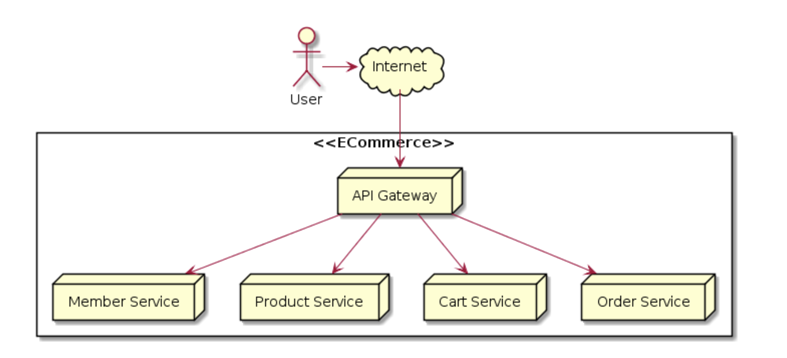

**Authentication**

- Validates credentials to **verify the identity** of a caller
- Examples: username/password login, OAuth token, API key, biometrics

**Authorization**

- Performed **after** authentication
- Validates whether the verified identity has **permission to access** the requested resource
- Examples: Access Control Lists (ACL), Role-Based Access Control (RBAC)

**Auth Service**

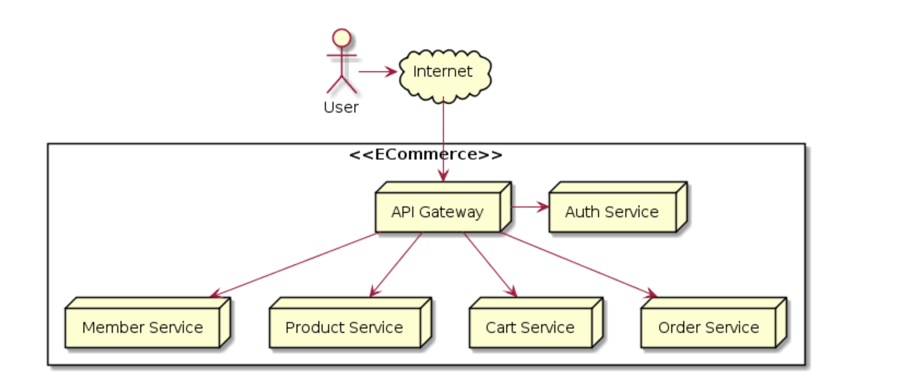

**Integration with Auth Service**

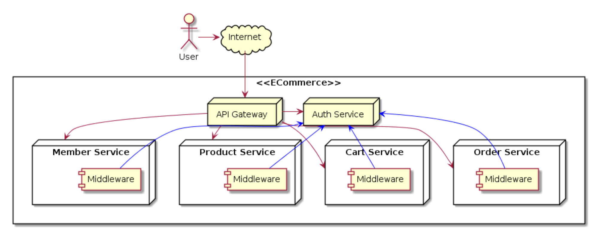

**API Gateway as Auth Middleware**

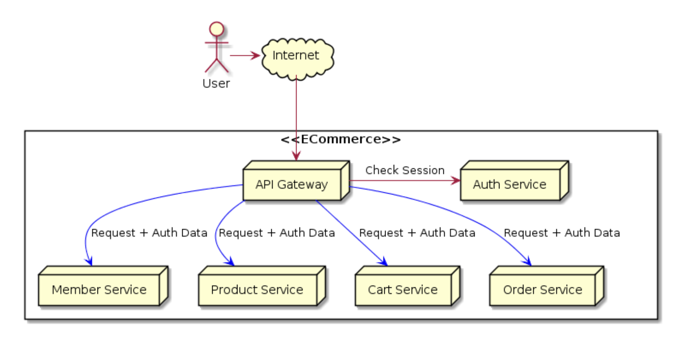

**Supporting Technologies**

- Secure Cookie
- OAuth
- JSON Web Token (JWT)
- Basic Auth
- API Key / Secret Key

---

## 📱 Backend for Frontend

> **Analogy:** A restaurant that serves both dine-in customers and delivery riders doesn't use the same counter for both. The dine-in counter is designed for sit-down orders; the delivery window is optimized for fast handoff. Each frontend (channel) has a backend tailored to exactly what it needs.

**The Problem with Many Frontend Types**

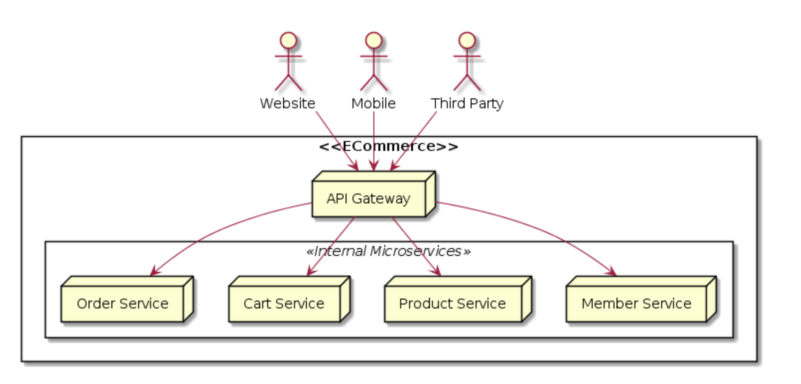

- Each frontend has **different authentication mechanisms** (web session vs. mobile token vs. smart TV)
- **Bandwidth varies** — a mobile app needs lightweight responses; a desktop web app can handle more
- **Required API shape differs** — mobile apps need compact, aggregated responses; desktop can make more granular calls
- **A single API Gateway must serve all needs** — leading to bloated, compromised APIs

**Backend for Frontend (BFF)**

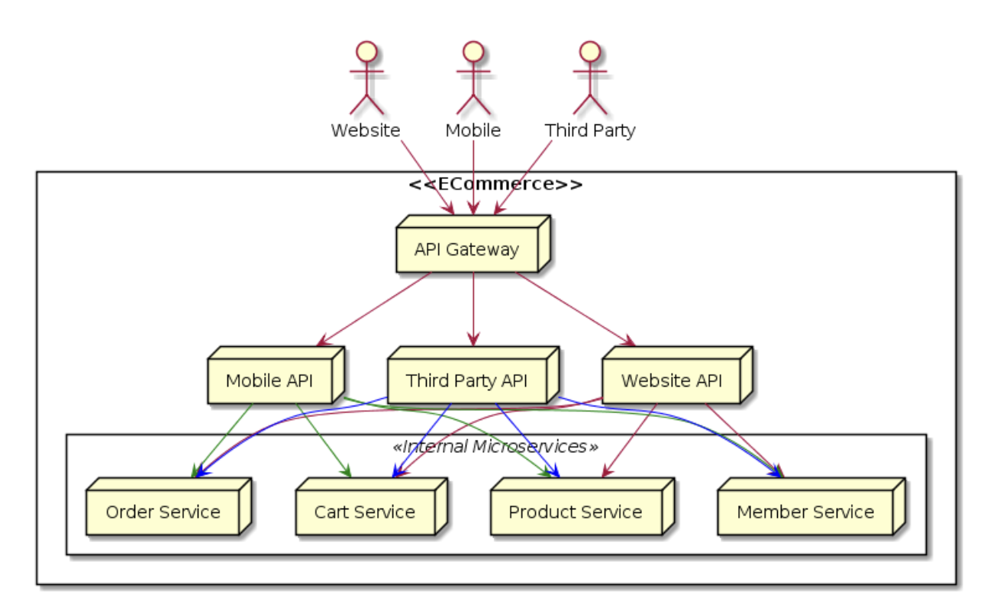

- BFF provides a **dedicated backend for each specific frontend**
- One backend per frontend type — mobile BFF, web BFF, TV BFF
- The more frontend types, the more BFFs are created
- Each BFF can be owned and iterated on independently by the corresponding frontend team

**Advantages of BFF**

- **Isolated development** — Each frontend's backend is developed separately without affecting others
- **Clean separation of concerns** — Frontend-specific logic doesn't pollute a shared backend layer

**GraphQL: An Alternative to BFF**

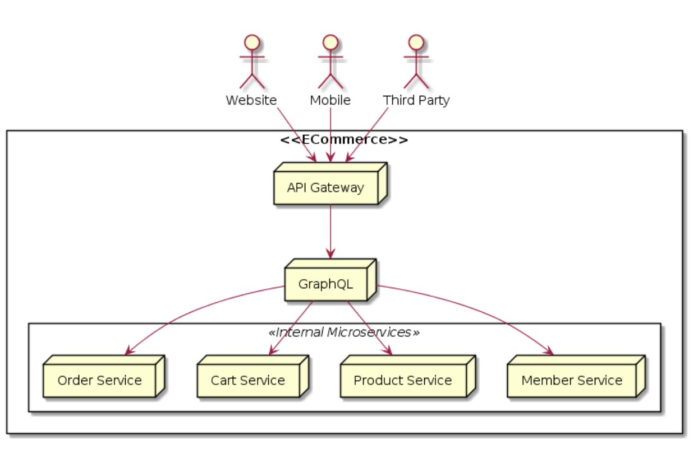

- GraphQL is a **query language for APIs**
- Allows frontend to **manipulate the response shape at runtime**
- Frontend decides exactly what data it wants — backend provides a complete graph and the client selects what it needs

**Drawbacks of GraphQL**

- Requires building a **GraphQL Server** on the backend
- Requires building a **GraphQL Client** on the frontend

---

## ⚡ CQRS (Command Query Responsibility Segregation)

> **Analogy:** A library separates its operations into two departments: the "Write" desk for returning and adding new books (commands), and the "Search" desk for finding books (queries). The search desk uses a fast digital catalog optimized for searching. The write desk updates the master ledger. They use different tools because their jobs are fundamentally different.

**Persistence Microservices**

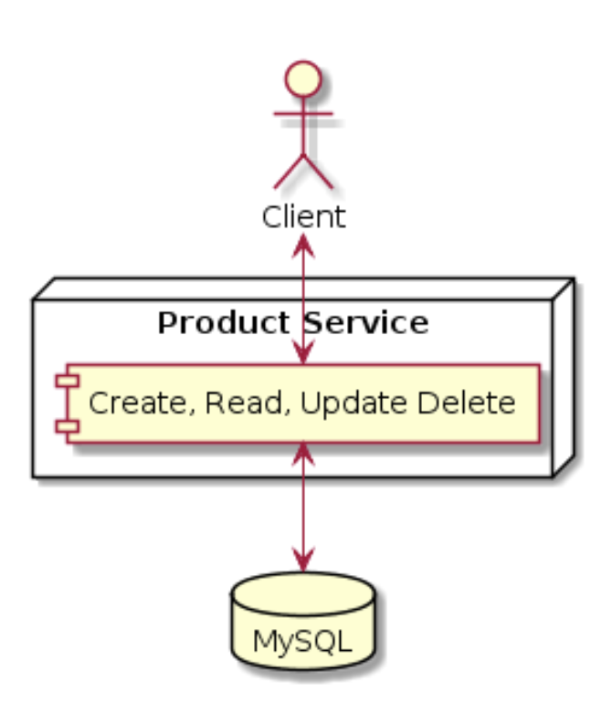

**What is CQRS?**

- CQRS separates **Command operations** from **Query operations**
- **Command** — operations that **change data** (Create, Update, Delete)
- **Query** — operations that **read data** (Get, Search)
- In CQRS, the service and/or database is split: one side for commands, one side for queries

**CQRS**

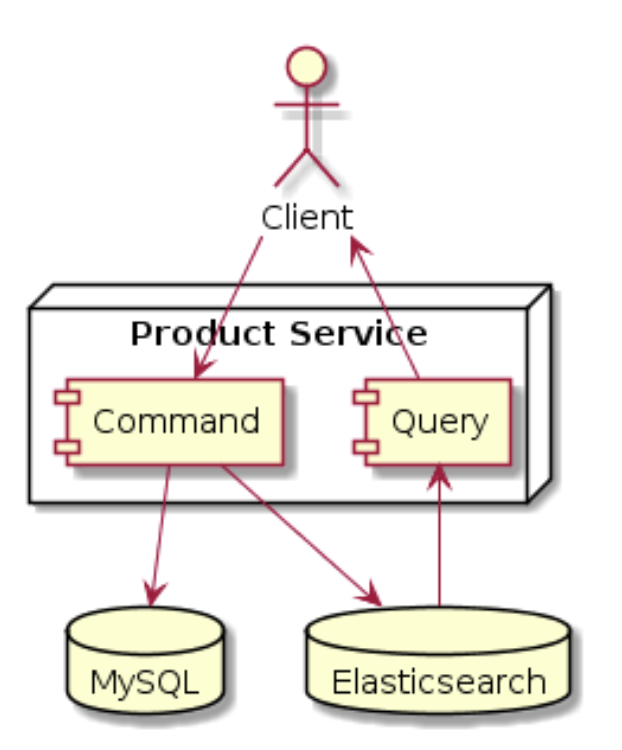

**Advantages of CQRS**

- **Optimal databases for each operation** — Use a write-optimized database for commands, a read-optimized database (e.g., Elasticsearch) for queries
- **Cleaner models** — Command and query models are separate; no single model trying to serve both
- **Better overall performance** — Read and write paths are independently optimized

**CQRS with Messaging**

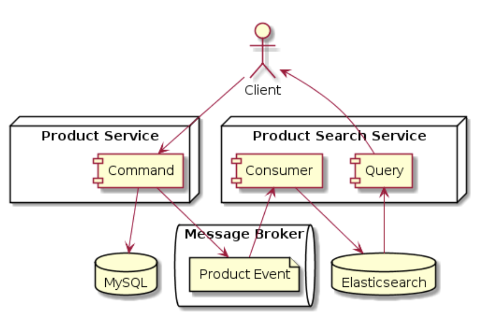

**Advantages of CQRS with Messaging**

- **Parallel development** — Command and Query applications can be built by separate teams simultaneously
- **Decoupled data flow** — The Command app only needs to publish events to the broker; it doesn't need to know the Query app's data structure
- **Independent scaling** — Scale the read side or write side based on actual load
- **Resilience** — If the Query app is down, events stay safely in the broker and are processed when it recovers
- **Easier retry** — Message brokers provide built-in retry and dead-letter mechanisms

---

## 🔃 Server Side Discovery

> **Analogy:** Every team in an office building gets a shared receptionist outside their room. When a visitor wants to reach "Team A," they just go to Team A's receptionist, who knows which desks are available and routes the visitor accordingly. The visitor never needs to know how many desks are inside.

**Communication Between Microservices**

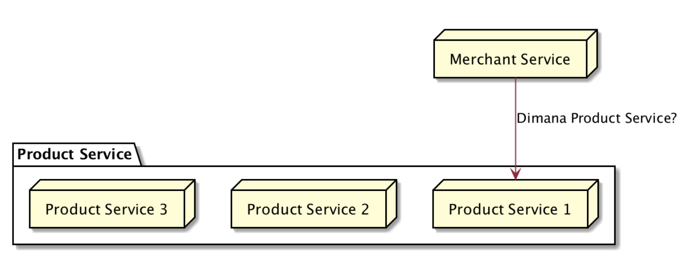

**What is Server Side Discovery?**

- A **dedicated router or load balancer** sits in front of each service
- The client only connects to the **router** — it doesn't need to know about individual service instances
- When instances are added or removed, **only the router changes** — the client stays untouched

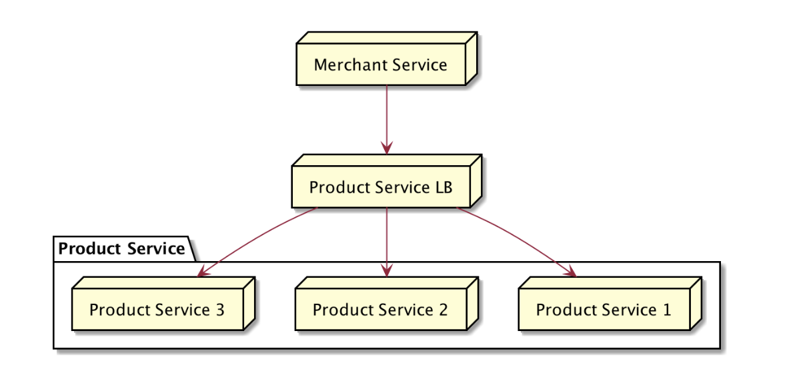

**Examples of Routers / Load Balancers**

- Nginx
- Apache HTTPD
- Traefik

**Disadvantages of Server Side Discovery**

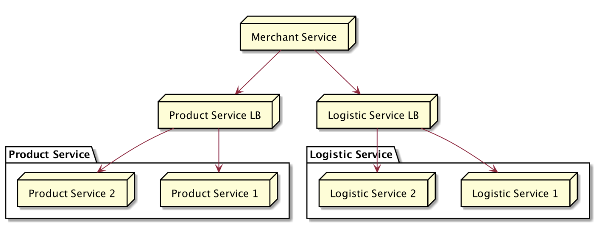

- **Every service needs its own router** — Operational overhead multiplies with service count
- **To avoid single point of failure**, each router must run as **at least 2 instances**
- **Higher cost** — Every service requires 2 router instances running at all times

---

## 🔍 Client Side Discovery

> **Analogy:** Instead of a receptionist, each visitor carries a personal directory book that lists all the desks in every room. When they need to visit Team A, they look it up themselves and walk directly to the right desk. Faster access — but now the visitor is responsible for keeping their directory book up to date.

**What is Client Side Discovery?**

- The **client itself is responsible** for knowing the location of all service instances
- **No router or load balancer** needed between services
- All load distribution logic is handled by the **client / calling service**

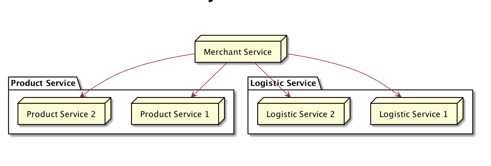

**Disadvantages of Client Side Discovery**

- **Client must know all service locations** — Tightly coupled to deployment topology
- **When instances are added or removed**, the client must be updated with the new locations
- **If the client implements load balancing incorrectly**, traffic to target services may be uneven

---

## 📋 Service Registry

> **Analogy:** A central company directory on the intranet. When a new employee joins, they register themselves: "My name is Bob, I'm in Room 412." When they leave, they de-register. When another employee needs Bob, they look him up in the directory — and the directory guarantees that Bob is actually reachable, because it performs regular health checks.

**What is Service Registry?**

- An application used as a **central store of all service location information**
- Every service **registers its address** when it starts up
- Every service **de-registers** when it shuts down, so the registry stops routing traffic to it

**Registering with Service Registry**

**Querying the Service Registry**

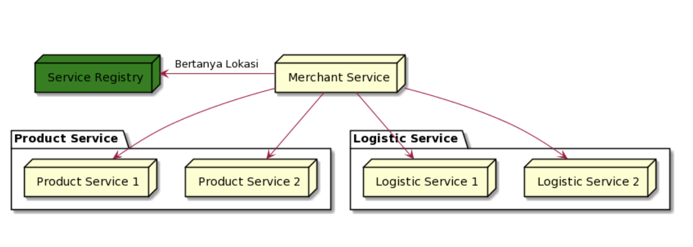

**Health Check in Service Registry**

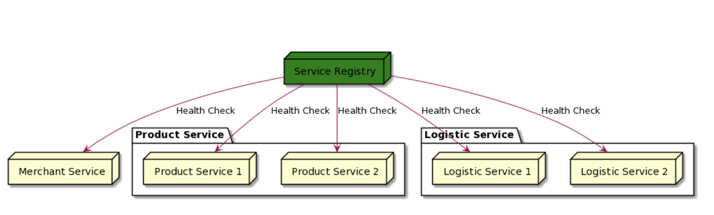

**Examples of Service Registry Applications**

- [Hashicorp Consul](https://www.consul.io/)
- [Netflix Eureka](https://github.com/Netflix/eureka)

---

## ⚙️ Centralized Configuration

> **Analogy:** Instead of every employee keeping a personal notebook of office rules and passwords, the company maintains one official intranet page with all the settings. When a rule changes, the intranet page is updated once — and everyone who reads it gets the new value automatically. No more "my copy says X, your copy says Y."

**Where to Store Configuration?**

Every application has configuration — database credentials, feature flags, timeouts, API endpoints. The question is: where should it live so it's easy to maintain and consume?

**Common Configuration Locations**

| Location | Trade-offs |
|----------|------------|
| **Database** | Persistent and queryable, but adds a DB dependency for startup |
| **File** | Simple and familiar, but hard to share across many service instances |
| **Environment Variable** | Lightweight and container-friendly, but managed per-instance |

**What is Centralized Configuration?**

- A pattern where **all configuration is stored in a dedicated service**
- Services that need configuration **pull it from this central service** at startup or runtime
- Changing a value in one place is reflected in all services without redeployment

**Getting Configuration**

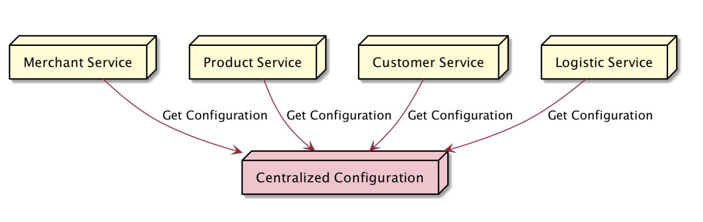

**Examples of Centralized Configuration Applications**

- [Hashicorp Consul](https://www.consul.io/)
- [Hashicorp Vault](https://www.vaultproject.io/)
- [Etcd](https://etcd.io/)
- [Apache Zookeeper](https://zookeeper.apache.org/)
- [Doozerd](https://github.com/ha/doozerd)

---

## 🎯 Quick Reference Table

| Pattern | Problem Solved | Key Trade-off |
|---------|---------------|---------------|
| **Database per Service** | Decouples data ownership between services | Each service manages its own schema and migrations |
| **Shared Database** | Speeds up monolith-to-microservices transition | Services remain coupled through the database schema |
| **NoSQL** | Matches data storage to access patterns | More operational complexity; no universal query language |
| **RPI / REST / gRPC** | Simple synchronous service-to-service calls | Caller is blocked waiting; downstream failures cascade |
| **Messaging** | Async, decoupled inter-service communication | Harder to trace and debug distributed flows |
| **Stateless Microservice** | Lightweight utility with no persistence | Cannot store state; must rely on other services for data |
| **Persistence Microservice** | Owns and manages a data domain | Must expose APIs; no direct DB access from other services |
| **Aggregation Microservice** | Coordinates business logic across services | Depends on multiple services; must handle partial failures |
| **Service Orchestration** | Centralized, easy-to-read business flow | Tight coupling; single point of failure for the flow |
| **Service Choreography** | Loose coupling via event-driven communication | Business logic is distributed and harder to trace |
| **API Gateway** | Single entry point for all client traffic | Potential bottleneck; must be highly available |
| **Backend for Frontend** | Tailored APIs per frontend type | More services to build and maintain |
| **GraphQL** | Flexible, runtime-shaped API responses | Additional GraphQL server and client complexity |
| **CQRS** | Separate read and write optimization | Eventual consistency between command and query sides |
| **Server Side Discovery** | Clients don't need to know service locations | Router per service doubles infrastructure cost |
| **Client Side Discovery** | No extra router infrastructure needed | Client logic must track and update service locations |
| **Service Registry** | Central source of truth for service locations | Registry itself must be highly available |
| **Centralized Configuration** | One place to manage all service config | Config service must be highly available at startup |

---

## 💡 Tips & Best Practices

- **Start with a monolith, migrate incrementally**
  - Don't microservice everything from day one; understand your domain boundaries first
  - Use the **Shared Database** pattern as a temporary bridge during migration

- **Use the right database for each service**
  - Relational DB for transactional data, Elasticsearch for search, Redis for caching
  - Never let one service query another service's database directly

- **Prefer Messaging over RPI for long-running or broadcast operations**
  - If the caller doesn't need an immediate response, use a message broker
  - Use RPI only when the result is needed synchronously to continue processing

- **Always put an API Gateway in front of your services**
  - Centralize authentication, rate limiting, and logging in one place
  - Never expose microservices directly to the public internet

- **Use JWT for stateless authentication across services**
  - The gateway validates the token; downstream services trust the forwarded identity
  - Avoids the need for each service to call the Auth Service on every request

- **Choose Orchestration or Choreography consciously**

  | Use Orchestration when... | Use Choreography when... |
  |--------------------------|--------------------------|
  | Flow is simple and linear | Flow is parallel or event-driven |
  | Traceability is critical | Services must be loosely coupled |
  | A single team owns the flow | Multiple teams own different services |

- **Implement health checks and graceful shutdown**
  - Register with your Service Registry on startup; de-register on shutdown
  - Without proper de-registration, other services may still route traffic to dead instances

- **Centralize configuration, externalize secrets**
  - Use a configuration service for non-sensitive settings
  - Use a secrets manager (Vault, AWS Secrets Manager) for credentials — never commit secrets to code

- **Design for failure**
  - Every network call can fail — implement timeouts, retries, and circuit breakers
  - Use the Bulkhead pattern to prevent one slow service from exhausting all connection pools
